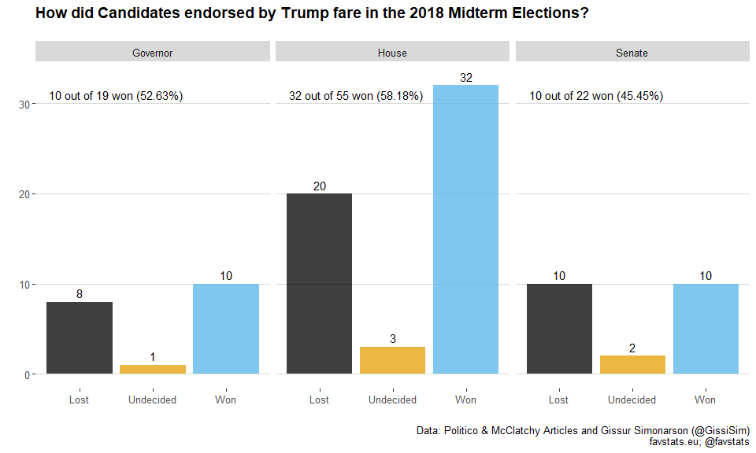
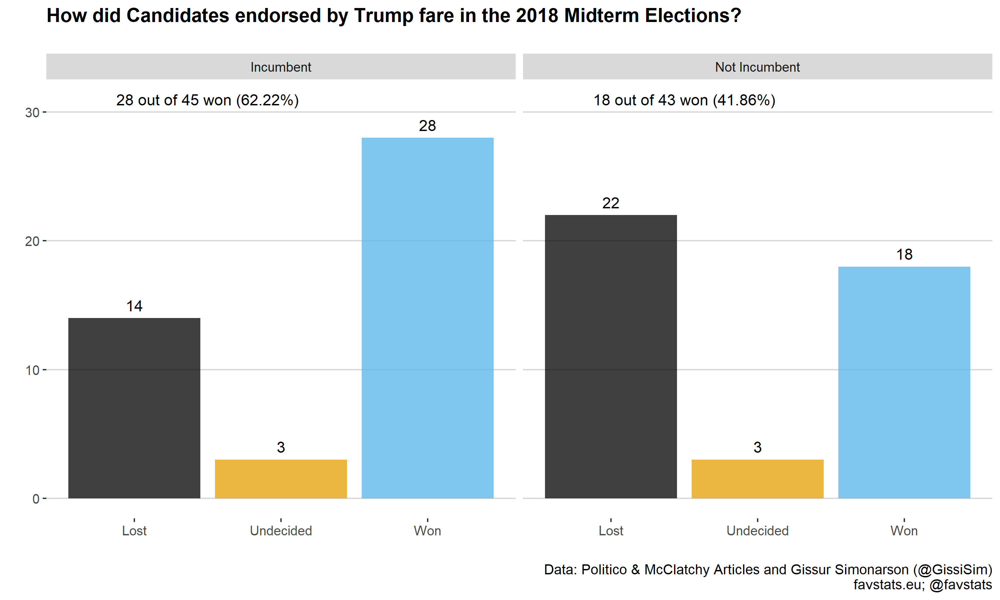

Trump Endorsements
================

Data
Sources:

<https://www.mcclatchydc.com/news/politics-government/election/midterms/article221145845.html>

<https://www.politico.com/story/2018/11/07/2018-election-results-trump-endorsements-967767>

## Packages

``` r
# devtools::install_github("favstats/tidytemplate")
# install.packages("pacman")
pacman::p_load(tidyverse, rvest, qdapRegex, ggthemes, tidytemplate, rtweet)
```

## Including Plots

``` r
candidate <- read_html("https://www.mcclatchydc.com/news/politics-government/election/midterms/article221145845.html") %>% 
  html_nodes("#content-body- li") %>% 
  html_text()

mcclatch <- tibble(candidate) %>% 
    mutate(won = case_when(
        str_detect(candidate, "✓") ~ "Won", 
        str_detect(candidate, "✗") ~ "Lost", 
        T~ "Undecided")) %>% 
    mutate(type = case_when(
        str_detect(candidate, "House") ~ "House", 
        str_detect(candidate, "Senate|senator") ~ "Senate", 
        str_detect(candidate, "governor|gubernatorial") ~ "Governor")) %>% 
    mutate(incumbent = ifelse(str_detect(candidate, "incumbent|Incumbent"), "Incumbent", "Not Incumbent")) %>% 
    mutate(candidate = str_remove(candidate, "✓|✗") %>% str_trim()) %>% 
    mutate(candidate = str_extract(candidate, ".+?(?=,)")) %>% 
    mutate(candidate = str_remove(candidate, "\\(GOING TO RECOUNT\\) ")) %>% 
    mutate(candidate = str_remove(candidate, "Runoff: "))

mcclatch
```

    ## # A tibble: 88 x 4
    ##    candidate        won       type     incumbent    
    ##    <chr>            <chr>     <chr>    <chr>        
    ##  1 <U+2713> Martha Roby    Undecided House    Incumbent    
    ##  2 <U+2713> Mike Dunleavy  Undecided Governor Not Incumbent
    ##  3 Martha McSally   Undecided Senate   Not Incumbent
    ##  4 <U+2713> Andy Biggs     Undecided House    Incumbent    
    ##  5 <U+2713> Doug Ducey     Undecided Governor Incumbent    
    ##  6 <U+2713> Asa Hutchinson Undecided Governor Incumbent    
    ##  7 Dana Rohrabacher Undecided House    Incumbent    
    ##  8 <U+2713> Devin Nunes    Undecided House    Incumbent    
    ##  9 <U+2717>  Diane Harkey  Undecided House    Not Incumbent
    ## 10 <U+2713> Kevin McCarthy Undecided House    Incumbent    
    ## # ... with 78 more rows

    ## # A tibble: 95 x 3
    ##    candidate      won       type    
    ##    <chr>          <chr>     <chr>   
    ##  1 Martha Roby    Won       House   
    ##  2 Mike Dunleavy  Undecided Governor
    ##  3 Martha McSally Undecided House   
    ##  4 Andy Biggs     Won       House   
    ##  5 Doug Ducey     Won       Governor
    ##  6 Asa Hutchinson Won       Governor
    ##  7 Paul Cook      Won       House   
    ##  8 Diane Harkey   Undecided House   
    ##  9 Devin Nunes    Won       House   
    ## 10 Kevin McCarthy Won       House   
    ## # ... with 85 more rows

## Checking for Missings/Errors/Disagreements between Data Sources

Let’s merge the datasets and see if we find any errors.

``` r
politico %>% 
  full_join(mcclatch, by = "candidate") %>% 
  filter(is.na(won.x) | is.na(won.y))
```

    ## # A tibble: 169 x 6
    ##    candidate      won.x     type.x   won.y type.y incumbent
    ##    <chr>          <chr>     <chr>    <chr> <chr>  <chr>    
    ##  1 Martha Roby    Won       House    <NA>  <NA>   <NA>     
    ##  2 Mike Dunleavy  Undecided Governor <NA>  <NA>   <NA>     
    ##  3 Andy Biggs     Won       House    <NA>  <NA>   <NA>     
    ##  4 Doug Ducey     Won       Governor <NA>  <NA>   <NA>     
    ##  5 Asa Hutchinson Won       Governor <NA>  <NA>   <NA>     
    ##  6 Paul Cook      Won       House    <NA>  <NA>   <NA>     
    ##  7 Diane Harkey   Undecided House    <NA>  <NA>   <NA>     
    ##  8 Devin Nunes    Won       House    <NA>  <NA>   <NA>     
    ##  9 Kevin McCarthy Won       House    <NA>  <NA>   <NA>     
    ## 10 John Cox       Lost      Governor <NA>  <NA>   <NA>     
    ## # ... with 159 more rows

Politico misspelled Patrick Morrisey.

Politico has more candidates but they did not include Mike Kelly.

Fix:

``` r
politico <- politico %>% 
  mutate(candidate = ifelse(candidate == "Patrick Morrissey", "Patrick Morrisey", candidate))
```

Do the datasets disagree on whether the candidate ran for House or
Senate?

``` r
politico %>% 
  left_join(mcclatch, by = "candidate") %>% 
  filter(type.x != type.y)
```

    ## # A tibble: 1 x 6
    ##   candidate      won.x     type.x won.y     type.y incumbent    
    ##   <chr>          <chr>     <chr>  <chr>     <chr>  <chr>        
    ## 1 Martha McSally Undecided House  Undecided Senate Not Incumbent

Politico states that Martha McSally ran for the House of Representatives
but this information seems to be wrong. She ran for Senate.

\-\> <https://mcsallyforsenate.com/>

Fix:

``` r
politico <- politico %>% 
  mutate(type = ifelse(candidate ==  "Martha McSally", "Senate", type)) 
```

Do the datasets disagree on whether a race was lost/won?

``` r
politico %>% 
  left_join(mcclatch, by = "candidate") %>% 
  filter(won.x != won.y)
```

    ## # A tibble: 1 x 6
    ##   candidate      won.x type.x won.y     type.y incumbent
    ##   <chr>          <chr> <chr>  <chr>     <chr>  <chr>    
    ## 1 Claudia Tenney Lost  House  Undecided House  Incumbent

Politico seems to not have updated Mike Dunleavy’s win yet (via The
Associated Press).

Data sources disagree on Diane Harkey. She is indeed projected to lose
(via The Associated Press).

Rick Scott is in the lead in the Senate Race (via The Associated Press).

Data sources also disagree on Claudia Tenney. Probably lost the race
(via The Associated Press).

Fix:

``` r
politico <- politico %>% 
  mutate(won = ifelse(candidate == "Diane Harkey", "Lost", won)) %>% 
  mutate(won = ifelse(candidate == "Mike Dunleavy", "Won", won))  %>% 
  mutate(won = ifelse(candidate == "Rick Scott", "Won", won))  

mcclatch <- mcclatch %>% 
  mutate(won = ifelse(candidate == "Claudia Tenney", "Lost", won)) 
```

No errors left :)

We can now use the Politico dataset as base, as it is the most complete
dataset:

``` r
trump_endorsements <- politico  %>% 
  left_join(mcclatch, by = "candidate") %>% 
  rename(results = won.x) %>% 
  rename(type = type.x) %>% 
  select(candidate, results, type, incumbent) %>% 
  arrange(candidate)

trump_endorsements
```

    ## # A tibble: 95 x 4
    ##    candidate       results   type     incumbent    
    ##    <chr>           <chr>     <chr>    <chr>        
    ##  1 Adam Laxalt     Lost      Governor <NA>         
    ##  2 Andy Barr       Won       House    <NA>         
    ##  3 Andy Biggs      Won       House    <NA>         
    ##  4 Asa Hutchinson  Won       Governor <NA>         
    ##  5 Bill Lee        Won       Governor <NA>         
    ##  6 Bill Schuette   Lost      Governor <NA>         
    ##  7 Bob Hugin       Lost      Senate   <NA>         
    ##  8 Bob Stefanowski Lost      Governor <NA>         
    ##  9 Brian Kemp      Undecided Governor Not Incumbent
    ## 10 Bruce Poliquin  Undecided House    Incumbent    
    ## # ... with 85 more rows

## @GissiSim Data

@GissiSim on Twitter collected some Trump Endorsements as well. Let’s
check them out:

``` r
token <- readRDS(".rtweet.rds")

tml <- get_timelines("GissiSim", n = 500, token = token)


save_it(tml)
```

``` r
tml <- load_it("data/tml.Rdata")

lastnames <- trump_endorsements %>% 
  mutate(lastname = str_remove(candidate, ".+?(?= )") %>% str_trim) %>% 
  .$lastname %>% paste0(collapse = "|")

tml %>% 
  filter(str_detect(text, "lost")) %>% 
  filter(!(str_detect(text, "Please let me know|That's 31|15 Trump|lost souls|democracy lost"))) %>%
  select(screen_name, text) %>% 
  mutate(lastnames = str_detect(text, lastnames)) %>% 
  filter(!(lastnames))
```

    ## # A tibble: 2 x 3
    ##   screen_name text                                                lastnames
    ##   <chr>       <chr>                                               <lgl>    
    ## 1 GissiSim    "Handel lost 51% to 50%\n\nhttps://t.co/TJZPJYGzR1" FALSE    
    ## 2 GissiSim    Randy lost 52% to 48% https://t.co/GlmUBxdHcz       FALSE

Karen Handel is not in the dataset but did receive an endorsement in
2017.

Randy is the first name of Randy Hultgren who is already in dataset.

Fix:

``` r
trump_endorsements <- trump_endorsements %>% 
  rbind(c("Karen Handel", "Lost", "House", "Incumbent"))

save_it(trump_endorsements)
```

## Plotting the Data

Let’s plot the data now :)

``` r
gg_dat <- trump_endorsements %>% 
  group_by(results, type) %>% 
  tally() %>% 
  ungroup()%>% 
  group_by(type) %>% 
  mutate(total = sum(n)) %>% 
  ungroup() 

gg_text <- gg_dat %>% 
  filter(results == "Won") %>% 
  mutate(perc = tidytemplate::get_percentage(n, total, 2)) %>% 
  mutate(text = paste0(n, " out of ", total, " won (", perc,"%)"))

gg_dat %>% 
  ggplot(aes(results, n, fill = results)) +
  geom_col(alpha = 0.75) +
  facet_wrap(~type) +
  theme_hc() +
  scale_fill_colorblind() +
  guides(fill = F) +
  labs(x = "", y = "",
       caption = "Data: Politico & McClatchy Articles and Gissur Simonarson (@GissiSim)\nfavstats.eu; @favstats") +
  geom_text(aes(label = n), nudge_y = 1) +
  geom_text(data = gg_text, aes(x = 1.5, y = 31, label = text)) +
  ggtitle("How did Candidates endorsed by Trump fare in the 2018 Midterm Elections?\n")  +
  theme(legend.text = element_text(size = 8),
    axis.title = element_text(size = 10, face = "bold"),
    plot.title = element_text(size = 14, face = "bold", hjust = 0),
    plot.caption = element_text(size = 10),
    legend.position = "bottom",
    legend.title = element_text(size = 8), 
    ) 
```

<!-- -->

``` r
ggsave_it(gg_freqs, width = 10, height = 6)
```

Plot by incumbents:

``` r
gg_dat2 <- trump_endorsements %>% 
  group_by(results, incumbent) %>% 
  tally() %>% 
  ungroup()%>% 
  group_by(incumbent) %>% 
  mutate(total = sum(n)) %>% 
  ungroup() %>% 
  drop_na(incumbent)

gg_text2 <- gg_dat2 %>% 
  filter(results == "Won") %>% 
  mutate(perc = tidytemplate::get_percentage(n, total, 2)) %>% 
  mutate(text = paste0(n, " out of ", total, " won (", perc,"%)"))

gg_dat2 %>% 
  ggplot(aes(results, n, fill = results)) +
  geom_col(alpha = 0.75) +
  facet_wrap(~incumbent) +
  theme_hc() +
  scale_fill_colorblind() +
  guides(fill = F) +
  labs(x = "", y = "",
       caption = "Data: Politico & McClatchy Articles and Gissur Simonarson (@GissiSim)\nfavstats.eu; @favstats") +
  geom_text(aes(label = n), nudge_y = 1) +
#  geom_text(data = gg_text2, aes(x = 1.5, y = 31, label = text)) +
  ggtitle("How did Candidates endorsed by Trump fare in the 2018 Midterm Elections?\n")  +
  theme(legend.text = element_text(size = 8),
    axis.title = element_text(size = 10, face = "bold"),
    plot.title = element_text(size = 14, face = "bold", hjust = 0),
    plot.caption = element_text(size = 10),
    legend.position = "bottom",
    legend.title = element_text(size = 8), 
    ) 
```

<!-- -->

``` r
ggsave_it(gg_freqs2, width = 10, height = 6)
```
